# Sistema de Laudos - Diagramas e Exemplos Práticos

> **Complemento** para `BACKEND-DOCUMENTATION.md` com diagramas visuais, exemplos de queries SQL e código de referência.

---

## 📋 Índice

1. [Diagrama Entidade-Relacionamento (ERD)](#1-diagrama-entidade-relacionamento-erd)
2. [Diagrama de Fluxo de Dados](#2-diagrama-de-fluxo-de-dados)
3. [Diagrama de Sequência - Login](#3-diagrama-de-sequência---login)
4. [Diagrama de Sequência - Criar Laudo](#4-diagrama-de-sequência---criar-laudo)
5. [Exemplos de Queries SQL](#5-exemplos-de-queries-sql)
6. [Exemplos de Código](#6-exemplos-de-código)
7. [Casos de Teste](#7-casos-de-teste)

---

## 1. Diagrama Entidade-Relacionamento (ERD)

```mermaid
erDiagram
    auth_users ||--|| profiles : "1:1"
    profiles ||--o{ user_roles : "1:N"
    profiles ||--o{ reports : "created_by 1:N"
    profiles ||--o{ reports : "assigned_to 1:N"
    reports ||--o{ report_audit_log : "1:N"
    reports ||--o{ vehicle_photos : "1:N"
    profiles ||--o{ report_audit_log : "user_id 1:N"

    auth_users {
        uuid id PK
        text email UNIQUE
        text encrypted_password
        timestamp email_confirmed_at
        timestamp created_at
        timestamp updated_at
    }

    profiles {
        uuid id PK_FK
        text username UNIQUE
        text email
        text name
        department department
        text badge
        boolean is_active
        boolean must_change_password
        timestamp last_login
        timestamp created_at
        timestamp updated_at
    }

    user_roles {
        uuid id PK
        uuid user_id FK
        app_role role
    }

    reports {
        uuid id PK
        text number UNIQUE
        report_status status
        priority priority
        uuid created_by FK
        uuid assigned_to FK
        timestamp assigned_at
        text location_address
        text location_city
        text location_state
        text location_coordinates
        text vehicle_plate
        text vehicle_chassi
        text vehicle_motor
        text vehicle_color
        text vehicle_brand
        text vehicle_model
        integer vehicle_year
        boolean vehicle_is_cloned
        boolean analysis_is_conclusive
        text analysis_justification
        text analysis_observations
        timestamp created_at
        timestamp updated_at
    }

    report_audit_log {
        uuid id PK
        uuid report_id FK
        text action
        uuid user_id FK
        text user_name
        text details
        timestamp timestamp
    }

    vehicle_photos {
        uuid id PK
        uuid report_id FK
        text part
        text photo_url
        timestamp created_at
    }
```

---

## 2. Diagrama de Fluxo de Dados

```mermaid
flowchart TB
    subgraph Frontend["Frontend (React)"]
        UI[UI Components]
        AuthContext[Auth Context]
        Services[Services Layer]
    end

    subgraph Supabase["Supabase Backend"]
        Auth[Supabase Auth]
        Database[(PostgreSQL)]
        EdgeFunctions[Edge Functions]
        Storage[Storage]

        subgraph RLS["Row Level Security"]
            ProfilesRLS[Profiles RLS]
            RolesRLS[User Roles RLS]
            ReportsRLS[Reports RLS]
            AuditRLS[Audit Log RLS]
            PhotosRLS[Photos RLS]
        end
    end

    UI --> Services
    Services --> AuthContext
    AuthContext --> Auth

    Services --> Database
    Services --> EdgeFunctions
    Services --> Storage

    Database --> RLS

    Auth -.->|auth.uid()| RLS

    EdgeFunctions -.->|SERVICE_ROLE_KEY| Database

    RLS --> ProfilesRLS
    RLS --> RolesRLS
    RLS --> ReportsRLS
    RLS --> AuditRLS
    RLS --> PhotosRLS
```

---

## 3. Diagrama de Sequência - Login


---

## 4. Diagrama de Sequência - Criar Laudo

```mermaid
sequenceDiagram
    actor Agent
    participant Frontend
    participant ReportService
    participant Database
    participant AuditLog

    Agent->>Frontend: Preenche formulário de novo laudo
    Agent->>Frontend: Clica "Criar Laudo"

    Frontend->>ReportService: createReport(reportData, createdBy)

    ReportService->>Database: SELECT name, department FROM profiles WHERE id = createdBy
    Database-->>ReportService: { name, department }

    Note over ReportService: Gera número do laudo
    ReportService->>Database: SELECT COUNT(*) FROM reports WHERE number LIKE 'YYYYMMDD-DEPT%'
    Database-->>ReportService: count

    Note over ReportService: Calcula: reportNumber = YYYYMMDD-DEPT-0001

    ReportService->>Database: INSERT INTO reports (...)

    alt Insert Sucesso
        Database-->>ReportService: report

        ReportService->>AuditLog: INSERT INTO report_audit_log<br/>(report_id, action: 'CREATED', ...)
        AuditLog-->>ReportService: Success

        ReportService->>Database: SELECT report WITH joins
        Database-->>ReportService: Full Report

        ReportService-->>Frontend: Report
        Frontend->>Agent: Mostra laudo criado
    else Insert Falha
        Database-->>ReportService: Error
        ReportService-->>Frontend: Error
        Frontend->>Agent: Mostra erro
    end
```



---

## 5. Exemplos de Queries SQL

### 5.1. Buscar todos os laudos de um policial

```sql
-- Query básica (sem RLS)
SELECT
  r.*,
  creator.name as created_by_name,
  officer.name as assigned_to_name
FROM reports r
LEFT JOIN profiles creator ON r.created_by = creator.id
LEFT JOIN profiles officer ON r.assigned_to = officer.id
WHERE r.assigned_to = 'uuid-do-policial'
ORDER BY r.created_at DESC;

-- Com RLS ativo (usuário autenticado como policial)
-- A query acima automaticamente filtra apenas laudos atribuídos ao usuário
-- devido à policy "Officers can view their assigned reports"
```

### 5.2. Buscar laudos atrasados

```sql
SELECT
  r.id,
  r.number,
  r.status,
  r.assigned_at,
  r.assigned_to,
  p.name as officer_name,
  CURRENT_DATE - r.assigned_at::date as days_overdue
FROM reports r
JOIN profiles p ON r.assigned_to = p.id
WHERE
  r.assigned_at < CURRENT_TIMESTAMP - INTERVAL '3 days'
  AND r.status != 'COMPLETED'
  AND r.status != 'CANCELLED'
ORDER BY r.assigned_at ASC;
```

### 5.3. Estatísticas por departamento

```sql
SELECT
  p.department,
  COUNT(*) FILTER (WHERE r.status = 'PENDING') as pending_count,
  COUNT(*) FILTER (WHERE r.status = 'RECEIVED') as received_count,
  COUNT(*) FILTER (WHERE r.status = 'IN_PROGRESS') as in_progress_count,
  COUNT(*) FILTER (WHERE r.status = 'COMPLETED') as completed_count,
  COUNT(*) FILTER (WHERE r.status = 'CANCELLED') as cancelled_count
FROM reports r
JOIN profiles p ON r.created_by = p.id
GROUP BY p.department
ORDER BY p.department;
```

### 5.4. Histórico completo de um laudo

```sql
SELECT
  r.number,
  r.status,
  r.created_at,
  al.action,
  al.user_name,
  al.details,
  al.timestamp,
  CASE
    WHEN al.action = 'CREATED' THEN 1
    WHEN al.action = 'ASSIGNED' THEN 2
    WHEN al.action = 'UPDATED' THEN 3
    WHEN al.action = 'CANCELLED' THEN 4
    ELSE 5
  END as action_order
FROM reports r
LEFT JOIN report_audit_log al ON r.id = al.report_id
WHERE r.id = 'uuid-do-laudo'
ORDER BY al.timestamp ASC;
```

### 5.5. Verificar se usuário tem permissão (usando função)

```sql
-- Verificar se usuário é AGENT
SELECT public.has_role('uuid-do-usuario', 'AGENT');

-- Usar em query
SELECT *
FROM reports
WHERE
  public.has_role('uuid-usuario-atual', 'AGENT')
  OR (public.has_role('uuid-usuario-atual', 'OFFICER') AND assigned_to = 'uuid-usuario-atual');
```

### 5.6. Buscar policiais disponíveis de um departamento

```sql
SELECT
  p.id,
  p.name,
  p.badge,
  p.department,
  COUNT(r.id) as active_reports
FROM profiles p
JOIN user_roles ur ON p.id = ur.user_id
LEFT JOIN reports r ON p.id = r.assigned_to
  AND r.status IN ('RECEIVED', 'IN_PROGRESS')
WHERE
  ur.role = 'OFFICER'
  AND p.is_active = true
  AND p.department = 'TRAFFIC'  -- Filtro por departamento
GROUP BY p.id, p.name, p.badge, p.department
ORDER BY active_reports ASC, p.name ASC;
```

---

## 6. Exemplos de Código

### 6.1. Implementar has_role em outra linguagem

**Python (SQLAlchemy):**
```python
from sqlalchemy import select, exists
from models import UserRole

def has_role(user_id: str, role: str) -> bool:
    """
    Verifica se um usuário tem uma role específica.

    Args:
        user_id: UUID do usuário
        role: 'AGENT' ou 'OFFICER'

    Returns:
        True se o usuário tem a role, False caso contrário
    """
    stmt = select(exists().where(
        UserRole.user_id == user_id,
        UserRole.role == role
    ))

    result = session.execute(stmt).scalar()
    return bool(result)
```

**Node.js (TypeScript + Prisma):**
```typescript
async function hasRole(userId: string, role: 'AGENT' | 'OFFICER'): Promise<boolean> {
  const userRole = await prisma.userRole.findFirst({
    where: {
      userId: userId,
      role: role
    }
  });

  return userRole !== null;
}
```

**Java (Spring Boot + JPA):**
```java
@Repository
public interface UserRoleRepository extends JpaRepository<UserRole, UUID> {
    boolean existsByUserIdAndRole(UUID userId, AppRole role);
}

// Uso
public boolean hasRole(UUID userId, AppRole role) {
    return userRoleRepository.existsByUserIdAndRole(userId, role);
}
```

---

### 6.2. Gerar número de laudo

**Python:**
```python
from datetime import datetime
from sqlalchemy import select, func

def generate_report_number(department: str, db_session) -> str:
    """
    Gera número único de laudo no formato YYYYMMDD-DEPARTMENT-XXXX

    Args:
        department: Departamento do criador (TRAFFIC, CRIMINAL, ADMINISTRATIVE)
        db_session: Sessão do banco de dados

    Returns:
        Número do laudo (ex: '20241130-TRAFFIC-0001')
    """
    # Data atual formatada
    date_str = datetime.now().strftime('%Y%m%d')

    # Contar laudos do dia para este departamento
    pattern = f"{date_str}-{department}-%"

    stmt = select(func.count()).select_from(Report).where(
        Report.number.like(pattern)
    )

    count = db_session.execute(stmt).scalar() or 0

    # Próximo número sequencial
    sequence = str(count + 1).zfill(4)

    # Número final
    return f"{date_str}-{department}-{sequence}"
```

**Node.js (TypeScript):**
```typescript
async function generateReportNumber(
  department: Department,
  prisma: PrismaClient
): Promise<string> {
  // Data atual formatada
  const date = new Date();
  const dateStr = date.toISOString().slice(0, 10).replace(/-/g, '');

  // Contar laudos do dia para este departamento
  const pattern = `${dateStr}-${department}-%`;

  const count = await prisma.report.count({
    where: {
      number: {
        startsWith: `${dateStr}-${department}-`
      }
    }
  });

  // Próximo número sequencial
  const sequence = String(count + 1).padStart(4, '0');

  // Número final
  return `${dateStr}-${department}-${sequence}`;
}
```

---

### 6.3. Implementar RLS em aplicação

Se o backend não tiver RLS nativo (como PostgreSQL), você deve implementar a lógica de permissões na aplicação:

**Python (FastAPI):**
```python
from fastapi import Depends, HTTPException, status
from typing import Optional

# Middleware de autenticação
async def get_current_user(token: str = Depends(oauth2_scheme)) -> User:
    user = await auth_service.verify_token(token)
    if not user:
        raise HTTPException(
            status_code=status.HTTP_401_UNAUTHORIZED,
            detail="Invalid authentication credentials"
        )
    return user

# Endpoint com verificação de permissão
@app.get("/reports")
async def get_reports(
    user: User = Depends(get_current_user),
    db: Session = Depends(get_db)
):
    # Verificar role
    is_agent = has_role(user.id, 'AGENT')

    if is_agent:
        # Agente vê todos os laudos
        reports = db.query(Report).all()
    else:
        # Policial vê apenas seus laudos
        reports = db.query(Report).filter(
            Report.assigned_to == user.id
        ).all()

    return reports

# Endpoint de criação com verificação
@app.post("/reports")
async def create_report(
    report_data: CreateReportRequest,
    user: User = Depends(get_current_user),
    db: Session = Depends(get_db)
):
    # Apenas agentes podem criar laudos
    if not has_role(user.id, 'AGENT'):
        raise HTTPException(
            status_code=status.HTTP_403_FORBIDDEN,
            detail="Only agents can create reports"
        )

    # Criar laudo...
    report = Report(
        number=generate_report_number(user.department, db),
        created_by=user.id,
        status='RECEIVED' if report_data.assigned_to else 'PENDING',
        # ... outros campos
    )

    db.add(report)
    db.commit()

    # Criar audit log
    audit = ReportAuditLog(
        report_id=report.id,
        action='CREATED',
        user_id=user.id,
        user_name=user.name,
        details='Laudo criado'
    )

    db.add(audit)
    db.commit()

    return report
```

---

### 6.4. Criar audit log

**Python:**
```python
def create_audit_log(
    report_id: str,
    action: str,
    user_id: str,
    user_name: str,
    details: Optional[str] = None,
    db_session = None
):
    """
    Cria uma entrada no log de auditoria.

    Args:
        report_id: UUID do laudo
        action: Ação realizada (CREATED, UPDATED, ASSIGNED, CANCELLED)
        user_id: UUID do usuário
        user_name: Nome do usuário
        details: Detalhes opcionais da ação
        db_session: Sessão do banco de dados
    """
    audit = ReportAuditLog(
        report_id=report_id,
        action=action,
        user_id=user_id,
        user_name=user_name,
        details=details,
        timestamp=datetime.utcnow()
    )

    db_session.add(audit)
    db_session.commit()
```

**Node.js (TypeScript):**
```typescript
async function createAuditLog(params: {
  reportId: string;
  action: string;
  userId: string;
  userName: string;
  details?: string;
}, prisma: PrismaClient): Promise<void> {
  await prisma.reportAuditLog.create({
    data: {
      reportId: params.reportId,
      action: params.action,
      userId: params.userId,
      userName: params.userName,
      details: params.details,
      timestamp: new Date()
    }
  });
}
```

---

## 7. Casos de Teste

### 7.1. Testes de Permissão (RLS)

**Teste 1: Agente pode ver todos os laudos**
```sql
-- Setup: Autenticar como agente
SET LOCAL role = authenticated;
SET LOCAL request.jwt.claim.sub = 'uuid-do-agente';

-- Query
SELECT COUNT(*) FROM reports;

-- Esperado: Deve retornar todos os laudos do sistema
```

**Teste 2: Policial vê apenas seus laudos**
```sql
-- Setup: Autenticar como policial
SET LOCAL role = authenticated;
SET LOCAL request.jwt.claim.sub = 'uuid-do-policial';

-- Query
SELECT COUNT(*) FROM reports;

-- Esperado: Deve retornar apenas laudos onde assigned_to = uuid-do-policial
```

**Teste 3: Policial não pode criar laudo**
```sql
-- Setup: Autenticar como policial
SET LOCAL role = authenticated;
SET LOCAL request.jwt.claim.sub = 'uuid-do-policial';

-- Query
INSERT INTO reports (number, status, priority, created_by)
VALUES ('20241130-TRAFFIC-0001', 'PENDING', 'MEDIUM', 'uuid-do-policial');

-- Esperado: Deve falhar (policy "Agents can create reports" bloqueia)
```

---

### 7.2. Testes de Regras de Negócio

**Teste 4: Número de laudo é único**
```sql
-- Criar laudo
INSERT INTO reports (number, status, priority, created_by)
VALUES ('20241130-TRAFFIC-0001', 'PENDING', 'MEDIUM', 'uuid-agente-1');

-- Tentar criar outro com mesmo número
INSERT INTO reports (number, status, priority, created_by)
VALUES ('20241130-TRAFFIC-0001', 'PENDING', 'HIGH', 'uuid-agente-2');

-- Esperado: Segundo insert deve falhar (UNIQUE constraint)
```

**Teste 5: Updated_at é atualizado automaticamente**
```sql
-- Criar laudo
INSERT INTO reports (number, status, priority, created_by)
VALUES ('20241130-TRAFFIC-0001', 'PENDING', 'MEDIUM', 'uuid-agente')
RETURNING id, created_at, updated_at;

-- Anotar created_at e updated_at (devem ser iguais)

-- Aguardar 1 segundo

-- Atualizar laudo
UPDATE reports
SET status = 'RECEIVED'
WHERE number = '20241130-TRAFFIC-0001'
RETURNING updated_at;

-- Esperado: updated_at deve ser maior que created_at
```

---

### 7.3. Testes de Fluxo

**Teste 6: Fluxo completo de laudo**
```python
def test_complete_report_workflow():
    # 1. Agente cria laudo
    agent = authenticate_as('agent.traffic', 'senha123')

    report = create_report(
        priority='HIGH',
        location={'address': 'Rua A', 'city': 'Salvador', 'state': 'BA'},
        vehicle={'plate': 'ABC1234', 'isCloned': False},
        created_by=agent.id
    )

    assert report.status == 'PENDING'
    assert report.number.startswith('20241130-TRAFFIC-')

    # 2. Agente atribui a policial
    officer = get_officer_by_username('officer.traffic1')

    report = assign_report(report.id, officer.id, agent.id)

    assert report.status == 'RECEIVED'
    assert report.assigned_to == officer.id
    assert report.assigned_at is not None

    # 3. Policial inicia trabalho
    authenticate_as('officer.traffic1', 'senha123')

    report = update_report(report.id, {'status': 'IN_PROGRESS'}, officer.id)

    assert report.status == 'IN_PROGRESS'

    # 4. Policial preenche dados
    report = update_report(
        report.id,
        {
            'vehicle': {
                'chassi': '9BWAA05U08P123456',
                'brand': 'Toyota',
                'model': 'Corolla',
                'year': 2024,
                'color': 'Preto'
            }
        },
        officer.id
    )

    assert report.vehicle['chassi'] == '9BWAA05U08P123456'

    # 5. Policial faz upload de fotos
    for part in ['Placa', 'Chassi', 'Motor']:
        upload_photo(report.id, part, f'photo_{part}.jpg')

    photos = get_photos(report.id)
    assert len(photos) >= 3

    # 6. Policial finaliza laudo
    report = update_report(
        report.id,
        {
            'status': 'COMPLETED',
            'analysis': {
                'isConclusive': True,
                'observations': 'Veículo em conformidade'
            }
        },
        officer.id
    )

    assert report.status == 'COMPLETED'
    assert report.analysis['isConclusive'] == True

    # 7. Verificar audit trail
    audit_logs = get_audit_logs(report.id)

    assert any(log['action'] == 'CREATED' for log in audit_logs)
    assert any(log['action'] == 'ASSIGNED' for log in audit_logs)
    assert any(log['action'] == 'UPDATED' for log in audit_logs)
```

---

## 📚 Referências

### SQL Utilities

**Resetar sequência de auto-incremento (se usar SERIAL):**
```sql
-- Não aplicável: usamos uuid_generate_v4()
```

**Backup de tabela específica:**
```sql
-- Backup de reports
pg_dump -U postgres -t public.reports laudo_db > reports_backup.sql

-- Restaurar
psql -U postgres laudo_db < reports_backup.sql
```

**Limpar todos os dados mantendo estrutura:**
```sql
TRUNCATE TABLE vehicle_photos CASCADE;
TRUNCATE TABLE report_audit_log CASCADE;
TRUNCATE TABLE reports CASCADE;
TRUNCATE TABLE user_roles CASCADE;
TRUNCATE TABLE profiles CASCADE;
-- auth.users deve ser limpo via Supabase Auth API
```

---

## 🔧 Ferramentas Úteis

### Testar RLS Localmente

```sql
-- Criar função helper para testar RLS
CREATE OR REPLACE FUNCTION test_rls_as_user(user_uuid UUID)
RETURNS void AS $$
BEGIN
  PERFORM set_config('request.jwt.claim.sub', user_uuid::text, true);
  PERFORM set_config('role', 'authenticated', true);
END;
$$ LANGUAGE plpgsql;

-- Uso:
SELECT test_rls_as_user('uuid-do-agente');
SELECT * FROM reports;  -- Vê todos

SELECT test_rls_as_user('uuid-do-policial');
SELECT * FROM reports;  -- Vê apenas atribuídos a ele
```

---

**Última Atualização:** 2024-11-30
**Versão:** 1.0
